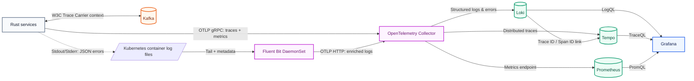

# AquaBid auction platform

AquaBid is a real-time marketplace for forward and reverse auctions. A forward auction moves toward the highest valid bid; a reverse auction moves toward the lowest valid bid. Auctions are generic and can represent an item, asset, service, capacity allocation, shipment, or contract.

The repository contains a Next.js marketplace, Rust edge and backend services, a Kafka event log, Redis live state, PostgreSQL system-of-record data, and the `auction-k8s` GitOps repository reconciled by Argo CD.

## Architecture

The request path is synchronous until gRPC ingestion durably appends the bid to Kafka. Bid decisions are then asynchronous and ordered by auction.

```mermaid
flowchart LR
  classDef client fill:#eff6ff,stroke:#2563eb,stroke-width:2px,color:#172554
  classDef edge fill:#ecfeff,stroke:#0891b2,stroke-width:2px,color:#164e63
  classDef service fill:#f8fafc,stroke:#64748b,stroke-width:2px,color:#0f172a
  classDef event fill:#fff7ed,stroke:#ea580c,stroke-width:2px,color:#7c2d12
  classDef actor fill:#f5f3ff,stroke:#7c3aed,stroke-width:2px,color:#3b0764
  classDef data fill:#ecfdf5,stroke:#059669,stroke-width:2px,color:#064e3b
  classDef ops fill:#fefce8,stroke:#ca8a04,stroke-width:2px,color:#713f12

  U[Browser / mobile UI]:::client --> W[Next.js web]:::client
  W -->|HTTPS API + socket ticket| G[Gateway Keeper]:::edge
  G -->|authenticated HTTP| H[HTTP server]:::service
  G -->|one-use WebSocket ticket| S[Socket server]:::service

  S -->|validated bid| I[gRPC ingestion]:::service
  I -->|key = auction_id| K[(Kafka: auction-bids)]:::event
  K --> P0[partition 0 worker]:::event
  K --> P1[partition 1 worker]:::event
  P0 --> AR1[engine pod A: DashMap actor registry]:::actor
  P1 --> AR2[engine pod B: DashMap actor registry]:::actor
  AR1 --> A1[auction A actor]:::actor
  AR1 --> A2[auction B actor]:::actor
  AR2 --> A3[auction C actor]:::actor

  A1 -->|accepted bid only| Redis[(Redis live state)]:::data
  A2 -->|accepted bid only| Redis
  A3 -->|accepted bid only| Redis
  Redis -->|Pub/Sub| S
  S -->|room update| U

  A1 -->|every decision| DT[(auction-bid-decisions)]:::event
  A2 -->|every decision| DT
  A3 -->|every decision| DT
  DT --> AW[bid audit consumer]:::ops
  AW -->|append-only decision| PG[(PostgreSQL)]:::data

  A1 -->|bid notification| NT[(auction-notifications)]:::event
  A2 -->|bid notification| NT
  A3 -->|bid notification| NT
  A1 -->|auction ended| ST[(auction-sync)]:::event
  A2 -->|auction ended| ST
  A3 -->|auction ended| ST
  NT --> NW[notification / sync worker]:::ops
  ST --> NW
  NW -->|operational bids + winner| PG
  NW --> DLQ[(auction-dlq)]:::event
  P0 -->|poison record| DLQ
  P1 -->|poison record| DLQ
  H <--> PG
  PG --> SCH[Scheduler]:::ops
  SCH -->|activate + hydrate| Redis
  PG -->|pg_dump read| BK[Daily backup CronJob]:::ops
  BK -->|private object backup| OBJ[(Cloudflare R2 object storage)]:::data
```



Kafka is intentionally behind gRPC ingestion, not Gateway Keeper. Gateway Keeper owns public authentication, throttling, circuit breaking, HTTP proxying, and WebSocket upgrades. The ingestion service owns bid-envelope validation and the broker acknowledgement returned to the socket service.

### Service responsibilities

| Component | Responsibility | Scaling boundary |
| --- | --- | --- |
| Web | Responsive marketplace, discovery, auction room, dashboard, and admin UI | Stateless replicas/CDN |
| Gateway Keeper | JWT validation, IP/user throttling, circuit breakers, signed identity, socket tickets, and HTTP/WebSocket proxying | Horizontal replicas; Redis shares counters |
| HTTP server | Authentication, auction CRUD, participants, media metadata, and database reads | Stateless replicas |
| Search server | Subscribes to CDC Kafka topics, generates embeddings, and exposes Elasticsearch endpoints | Stateless replicas |
| CDC worker | Captures Postgres logical replication events and produces JSON payloads to Kafka topics | Single replica per slot |
| Socket server | Auction rooms, participant checks, bid transport, and live fan-out | Replicas share the Redis Socket.IO adapter |
| gRPC ingestion | Validates bid envelopes and appends idempotent, keyed Kafka records | Stateless producer replicas |
| Kafka | Durable ordered bid log, notification/sync work, replay, and consumer-group assignment | Partition count limits useful consumer parallelism |
| Auction engine | Runs one sequential Kafka worker per assigned partition and one supervised actor per active auction | Add consumers up to the bid-topic partition count |
| Scheduler | Hydrates due auction configuration and participant data from PostgreSQL into Redis | Database-safe claiming coordinates replicas |
| Notification/audit/sync worker | Continuously archives every decision, sends notifications, finalizes operational bids/winners, and sweeps missed closes | Separate Kafka consumer groups and topic partitions |

## Kafka ordering and failover

`auction-bids` has a fixed partition count. Every producer uses `auction_id` as the Kafka record key, so Kafka’s partitioner always maps one auction to one partition. Kafka preserves record order inside that partition.

Each auction-engine process joins the `auction-engine` consumer group. Within a process, records are dispatched to one bounded sequential worker per Kafka partition. That worker sends the record to the correct per-auction actor and does not commit the Kafka offset until the actor and Redis ledger return success. Different partitions and different auction actors still run concurrently.

When an engine pod stops:

1. Kafka detects the lost consumer and reassigns its partitions to surviving group members.
2. The new owner resumes from the last committed offset.
3. A record processed immediately before the failure may be delivered again if its asynchronous offset commit was not stored.
4. An accepted bid is deduplicated by its Redis request key; a rejected decision is deduplicated by its PostgreSQL audit primary key. This is intentional at-least-once processing rather than unsafe at-most-once delivery.

Changing a topic’s partition count changes future key-to-partition mappings. Do not increase `auction-bids` partitions while auctions are active. Create a versioned topic and drain/cut over between auction windows when capacity must change.

The default topology is:

| Topic | Partitions | Retention | Key / consumer group |
| --- | ---: | ---: | --- |
| `auction-bids` | 32 in Kubernetes, 16 locally | 30 days | `auction_id` / `auction-engine` |
| `auction-bid-decisions` | 8 in Kubernetes, 4 locally | 90 days | `auction_id` / `auction-bid-audit-worker` |
| `auction-notifications` | 8 in Kubernetes, 4 locally | 7 days | auction or email / `auction-notification-worker` |
| `auction-sync` | 8 in Kubernetes, 4 locally | 30 days | `auction_id` / `auction-sync-worker` |
| `auction-dlq` | 8 in Kubernetes, 4 locally | 90 days | original key / operational consumers |

## Per-auction actors and backpressure

Each engine pod has a `DashMap<auction_id, actor>`. An atomic entry operation dynamically creates a missing actor, preventing duplicate local actors when first bids race. Actor handles and lifecycle state use separate 64-byte-aligned values to reduce false sharing.

Each actor owns a bounded MPSC inbox and processes one auction sequentially. Forward bids must increase the current price by `minimum_bid_step`; reverse bids must reduce it by the same rule. A forward reserve is checked when the auction closes.

The supervisor wraps the actor loop in `AssertUnwindSafe(...).catch_unwind()`. If it panics, the supervisor keeps the mutex-protected receiver, waits with bounded exponential backoff, restores runtime state from Redis, and restarts the loop. A dropped actor reply makes the partition worker retry the uncommitted Kafka record.

Backpressure is bounded at two levels:

- each Kafka partition dispatcher has `AUCTION_KAFKA_PARTITION_QUEUE_CAPACITY` records, default `1000`;
- each auction actor has `AUCTION_ACTOR_QUEUE_CAPACITY` messages, default `5000` (`1000` in the test Compose stack).

A single extremely hot auction remains intentionally sequential. Adding partitions and engine pods raises aggregate throughput across auctions; it does not make one auction multi-writer. If one auction exceeds one actor’s capacity, use a dedicated sequenced partition and deterministic reducer rather than allowing concurrent price writers.

## Ledger, auditing, and idempotency

Each bid carries a UUID request ID. For an accepted bid, the actor executes one Redis Lua script that atomically:

- rejects request IDs already seen within the 24-hour deduplication window;
- appends the accepted bid to sync and live Redis Streams;
- writes the accepted bid to the sorted set used for ranking;
- colocates all keys for an auction using a Redis Cluster `{auction_id}` hash tag.

Rejected bids are not stored in Redis. After every decision, accepted or rejected, the actor must append an `auction-bid-decisions` record before the source bid offset can be committed. For accepted bids, the Redis request key stores the exact decision payload. A replay checks this accepted-only key before treating the now non-improving amount as a rejection, then republishes the original decision without applying the bid again. Rejected decisions can be safely republished because PostgreSQL uses `request_id` as the audit primary key.

The `auction-bid-audit-worker` consumer continuously inserts every accepted and rejected decision into the append-only `bid_audit_events` PostgreSQL table. A database trigger rejects updates and deletes. The row stores price before/after, rejection reason, submission/processing times, and source Kafka topic/partition/offset. A well-formed decision offset is committed only after PostgreSQL acknowledges the idempotent insert; a database outage creates consumer lag rather than an audit gap. Owners and participants can query this history through `GET /api/auction/{auction_id}/audit?limit=100&offset=0`.

Redis Pub/Sub fans live decisions to Socket.IO rooms and Kafka carries notification work. At close, the actor publishes an `auction-sync` record. The sync consumer copies accepted Redis bids into the operational `bids` table, calculates the winner, cleans volatile Redis state, and commits only after success. The audit table is already populated continuously and is not dependent on auction close.

PostgreSQL now provides permanent queryable decision auditing, while Kafka retains replayable input and decision logs for finite periods. There is still no Kafka-to-S3 bid-dump actor or sink connector. If regulations require write-once object evidence, add a separate Kafka Connect sink or archival consumer with object lock/versioning; PostgreSQL backups alone are not immutable evidence.

## Gateway Keeper

Gateway Keeper remains the only public backend entry point in Kubernetes.

- Public sign-up/login routes are proxied without an existing JWT; other API calls require a valid HS256 JWT, expiry, UUID subject, and supported role.
- Caller-supplied internal identity headers are removed, then user, role, timestamp, request ID, and an HMAC-SHA256 signature are injected.
- Redis-backed fixed-window limits apply per IP and user, with a cache-line-aligned local DashMap as degraded fallback.
- Independent HTTP and socket circuit breakers open after repeated downstream failures and later permit a probe.
- A socket ticket is single-use, expires after 30 seconds, and is issued only to a confirmed auction participant.
- `/health` checks the process; `/readyz` also checks Redis.

Network policy should prevent public access to HTTP, WebSocket, gRPC, Redis, PostgreSQL, and Kafka. Downstream services must verify the signed identity timestamp and signature. With multiple gateway replicas, move process-local socket tickets to Redis with atomic consume and TTL to remove affinity requirements.

## Kubernetes: Strimzi and KRaft

`auction-k8s` uses a shared branch-selected Argo chart and one active environment per cluster. Controllers reconcile before sealed secrets, infrastructure, and individually ordered application servers. Both environments use one Strimzi KRaft broker/controller for the small test profile, with persistent storage and five declarative topics. The internal TLS listener is `auction-kafka-kafka-bootstrap.kafka.svc.cluster.local:9093`; GitHub Environment secrets supply the broker certificate/private key and matching client CA.

Redis runs one primary and two read replicas. PostgreSQL uses a cloud URL. This test profile has no Kafka broker redundancy or automatic Redis primary promotion. See [the GitOps guide](auction-k8s/README.md) for resource budgets, bootstrap, secret inputs, domains, monitoring and existing-cluster migration constraints.

## Production observability

Operational errors do not use Kafka. Every Rust service emits a single-line JSON event to stderr with `service`, `code`, `severity`, environment, region, host, timestamp, and safe request context. Fatal service exits and panics use the same format; expected client failures such as authentication rejection and invalid bids are not promoted to production error events.



Kubernetes' container runtime writes stdout/stderr to node files under `/var/log/containers`. A pinned Fluent Bit DaemonSet tails those files, enriches records with Kubernetes metadata, parses JSON bodies, and sends OTLP logs to the collector. The collector exports logs to Loki, traces to Tempo, and metrics to a Prometheus-scraped endpoint. Grafana provisions all three data sources, the `Auction service errors` dashboard, and trace/log links. Promtail is disabled to avoid duplicate log ingestion.

The Rust services export request and processing spans plus service-start/error counters to `otel-collector.monitoring.svc.cluster.local:4317`. The gRPC ingestion span injects W3C `traceparent` context into each Kafka bid envelope; the destination auction actor restores it as the parent of its per-bid span. Structured error events also include `trace_id` and `span_id` whenever they occur inside a traced operation.

The relevant Loki query is:

```logql
{namespace="auction"} | json | event_type="service_error"
```

Kafka remains reserved for ordered business events, replay, bid decisions, synchronization, and DLQ records. For paging, configure Grafana alerting on CRITICAL events, the `auction_auction_service_errors_total` metric, collector exporter failures, and Fluent Bit delivery failures.

## Scaling and recovery

```text
more page/API traffic       -> add web, Gateway Keeper, and HTTP replicas
more socket connections     -> add Socket replicas; Redis shares rooms/events
more simultaneous auctions  -> add engine consumers up to Kafka partition count
more notification/sync work -> add consumers up to those topics' partition counts
larger live state           -> Redis Cluster with auction hash tags
larger durable history      -> PostgreSQL partitioning/read replicas + object archive
```

Scale engines from Kafka consumer lag and decision latency, not CPU alone. Also monitor per-actor inbox depth, Redis script latency, socket fan-out delay, DLQ growth, and PostgreSQL finalization lag. During engine scale-down, stop readiness first and allow the consumer to leave the group; uncommitted records are replayed by the new partition owner.

PostgreSQL remains the long-term system of record and is hosted in the cloud. The custom PostgreSQL deployment and in-cluster backup CronJob are removed; configure backup retention and point-in-time recovery with the database provider.

Recovery sequence:

1. Restore PostgreSQL into an isolated database and validate integrity.
2. Restore or recreate Kafka and Redis with bid intake disabled.
3. Confirm Kafka topic health, committed offsets, consumer lag, and DLQ contents.
4. Rehydrate scheduled/live auctions and run the finalization sweeper.
5. Re-enable Gateway Keeper traffic and verify API, socket, bid, replay, and close canaries.

## Resource-limited local stack

[`docker-compose.test.yaml`](./docker-compose.test.yaml) starts the complete stack with CPU, memory, and PID caps. Kafka runs as one Apache Kafka `3.8.0` KRaft broker/controller; `kafka-init` creates the fixed topics before producers and consumers start. PostgreSQL applies migrations and loads nine idempotent demo auctions for the next two months on first volume initialization.

```bash
docker compose -f docker-compose.test.yaml up --build
```

Open:

- marketplace: `http://localhost:3000`
- Gateway Keeper: `http://localhost:8080`
- Kafka client bootstrap: `127.0.0.1:9092`
- PostgreSQL and Redis are bound only to `127.0.0.1` for local diagnostics.

The configured limits total approximately 4.75 CPUs and 3.3 GiB if every long-running service reaches its cap. Test credentials and signing keys must never be reused outside a local machine.

```bash
docker compose -f docker-compose.test.yaml down
```

PostgreSQL and Kafka volumes are retained. `down -v` intentionally deletes local test data and the Kafka log.

## Development

Requirements: Rust stable, Bun 1.3+, PostgreSQL 16, Redis 7, Kafka 3.8+, CMake, and `protoc`.

```bash
bun install
bun run dev
```

Useful checks:

```bash
bun run check-types
bun run lint
cargo test --workspace
docker compose -f docker-compose.test.yaml config
kubectl kustomize auction-k8s/infra/overlays/dev >/dev/null
kubectl kustomize auction-k8s/infra/overlays/prod >/dev/null
```

Repository map:

```text
apps/web                  Next.js marketplace and dashboards
apps/gateway-keeper       public edge proxy, auth, throttling, and breakers
apps/http-server          REST API and PostgreSQL access
apps/ws-server            Socket.IO auction rooms
apps/grpc                 bid validation and keyed Kafka producer
apps/auction-engine       Kafka partition workers + supervised auction actors
apps/scheduler            scheduled auction activation
apps/notification-worker  Kafka notifications, finalization, and recovery sweep
packages/db               Diesel schema, migrations, and two-month demo data
packages/redis            cluster-safe key conventions and pools
packages/kafka            Kafka clients, topics, producer, and consumer defaults
packages/observability    OpenTelemetry setup plus structured error/panic events
apps/cdc-worker           logical replication CDC from Postgres to Kafka
apps/search-server        Kafka consumer and Elasticsearch embedding search API
auction-k8s               Argo CD, Strimzi, KRaft, and application GitOps state
```

CI checks and builds all eight application images. Pushes to `deployment` update GitOps `deployment`; pushes to `main` update GitOps `main` with immutable image digests. Each build embeds the matching frontend URLs, and delivery commits environment-specific SealedSecrets.


<!-- hyper liquid and memcoin -->